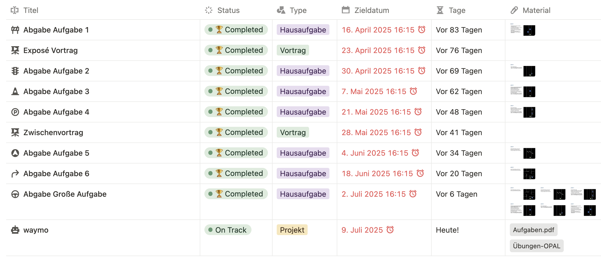

# Abschlussvortrag: ROS 2 Projekt "waymo"

<!-- data-type="none" -->
| Parameter            | Kursinformationen                                                                     |
| -------------------- | --------------------------------------------------------------------------------------|
| **Veranstaltung:**   | `Robotik Projekt`                                                                     |
| **Semester**         | `Sommersemester 2025`                                                                 |
| **Hochschule:**      | `Technische Universität Bergakademie Freiberg`                                        |
| **Inhalte:**         | `Abschluss-Vortrag`                                                                   |
| **Link auf GitHub:** | https://github.com/Bigfire3/waymo/blob/documentation/presentation/abschlussvortrag.md  |
| **Autoren**          | Fabian Zänker, Lucas Adler, Simon Hörtzsch @author                                    |

+ Gruppenmitglieder: Fabian Zänker, Lucas Adler, Simon Hörtzsch  
+ Studiengang: Robotik | Mathematik in Wirtschaft, Engineering und Informatik | Angewandte Informatik
+ Betreuer: Prof. Dr. Sebastian Zug, Gero Licht  
+ Datum: 09.07.2025

---

## 1. Projektstand

---

## 2. Einschätzung Finale Abgabe der großen Aufgabe

                         {{0-1}}
********************************************************************************

**Beobachtungen:**

+ Netzwerkproblem sorgte für unsauberes Fahren
+ Ampelerkennung fiel aufgrund von falschen Filter-Parametern aus
+ fehlende Möglichkeit des Testens auf weißem Untergrund sorgte für Probleme bei der Fahrbahnverfolgung, Schilderkennung und dem Befahren der Kreuzung

********************************************************************************

                         {{1-2}}
********************************************************************************

**Selbskritik:**

+ Implementierung der Schilderkennung war nicht robust genug

  + Verlass auf Template-Matching führte zu starker Abhängigkeit der Lichverhältnisse

+ Fahrbahnverfolgung war zu sehr auf die Rahmenbedingungn des schwarzen Untergrundes fokussiert
  
  + Klarheit der Kanten
  + exakte Dicke der Linien
  + Blur, um der Reflexion entgegenzuwirken

+ Befahrung der Kreuzung war nicht robust genug, um nach Kurven in korrekte Ausgangslage zu gelangen
  
  + Roboter fuhr zu weit nach links oder zu weit nach rechts, bevor der Roboter am Referenzpunkt war
  + Roboter fand dadurch nicht die Fahrbahn am Ende es Manövers

********************************************************************************

---

## 3. Demonstration

                         {{0-1}}
********************************************************************************

**Ampelerkennung zur Abgabe**:
  !?[Demo-Video Ampelerkennung zur Abgabe](https://youtu.be/d3KgZaakcwA)

**Ampelerkennung wie sie hätte sein sollen**:
  !?[Demo-Video korrekte Ampelkennung](https://youtu.be/)

********************************************************************************

                         {{1-2}}
********************************************************************************

**Schildererkennunung und Fahrbahnverfolgung zur Abgabe**:
  !?[Demo-Video Schildererkennung und Fahrbahnverfolgung zur Abgabe](https://youtu.be/edc1gaQIQTE)

**Schildererkennung und Fahrbahnverfolgung wie sie hätte sein sollen**:
  !?[Demo-Video korrekte Schildererkennung und Fahrbahnverfolgung](https://youtu.be/SeLRsbMG1Wc)

********************************************************************************

                         {{2-3}}
********************************************************************************

**Kreuzung zur Abgabe**:
  !?[Demo-Video Kreuzung zur Abgabe](https://youtu.be/x7_WZDuxvvk)

**Kreuzung wie sie hätte sein sollen**:
  !?[Demo-Video korrekte Kreuzung](https://youtu.be/)

********************************************************************************

---

## 4. Robustheit

**Histogramm bei Kreuzungs-Überquerung**:
  
  

---

## 5. Gesamtfazit

**Demo-Video Parkour:**
  !?[Demo-Video korrekter Parkour](https://youtu.be/)

## 6. Ausblick

                         {{0-1}}
********************************************************************************

+ Umstellung der Schilderkennung von Template-Matching auf gut trainiertes Machine Learning Modell
+ Anpassen der Fahrbahnverfolgungs-Parameter für sauberes Fahren auf beiden Untergründen
+ Kreuzung: Nutzung des Histogramms auch bei Abbiegemanövern
+ Ampel: Anpassen der Region of Interest

********************************************************************************

                         {{1-2}}
********************************************************************************

**Vielen Dank für Ihre Aufmerksamkeit!**

**Fragen?**

********************************************************************************
