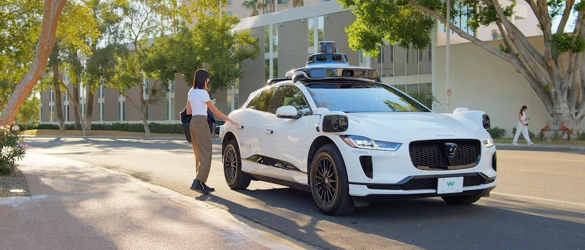
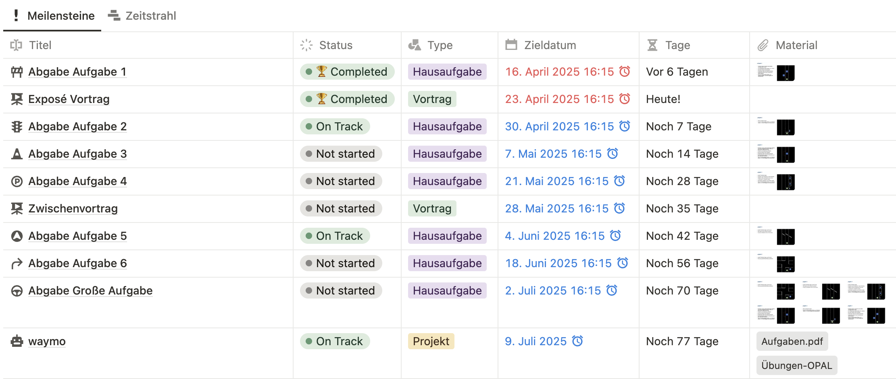
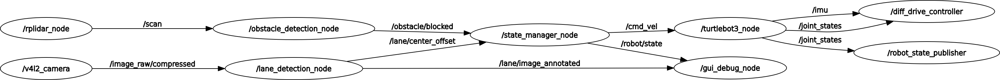

# Exposé-Vortrag: ROS2 Projekt "waymo"

<!-- data-type="none" -->
| Parameter            |Kursinformationen                                                     |
| -------------------- | -------------------------------------------------------------------- |
| **Veranstaltung:**   | `Robotik Projekt`                                                    |
| **Semester**         | `Sommersemester 2025`                                                |
| **Hochschule:**      | `Technische Universität Berkakademie Freiberg`                       |
| **Inhalte:**         | `Exposé Vortrag`                                                     |
| **Link auf GitHub:** | https://github.com/Bigfire3/waymo/blob/documentation/expose.md       |
| **Autoren**          | Fabian Zänker, Lucas Adler, Simon Hörtzsch @author                   |

+ Gruppenmitglieder: Fabian Zänker, Lucas Adler, Simon Hörtzsch  
+ Studiengang: Robotik | Mathematik in Wirtschaft, Engineering und Informatik | Angwandte Informatik
+ Betreuer: Prof. Dr. Sebastian Zug, Gero Licht  
+ Datum: 23.04.2025

---

## 1. Einleitung & Motivation

Entwicklung eines ros2-Packages, welches den Roboter auf Grundlage von bestimmten Fahrbahnszenarios steuert.

**Hauptziel**

Roboter fährt voll automatisiert auf einer vorher nicht bekannten Fahrbahn, lediglich die Fahrbahnszenarios sind durch definierte Aufgaben bekannt.

---

## 3. Projekt Organisation

## 2. Systemarchitektur & Komponenten

+ **Nodes:**
  - gui_debug_node.py
  - state_manager_node.py
  - lane_detection_node.py
  - obstacle_detection_node.py
+ Visualisierung der Node-Interaktionen (Nodes und Topics):

    

+ Wichtige externe Bibliotheken:
  - OpenCV (für Auswertung und Debugging mit Kamerabildern)
  - NumPy
  - Matplotlib

---

## 3. Kernfunktionen & Implementierungsdetails

+ **Fahrbahnerkennung:**
  - Nutzung von ([Dokumentation und Guide zur Real-Time Lane Detection](https://automaticaddison.com/the-ultimate-guide-to-real-time-lane-detection-using-opencv/)) von Addison Sears-Collins
  - Anpassung der Parameter und Ergänzung von Filtern für unser Szenario
  - Herausforderungen: Reflexion von indirekten Lichtquellen
+ **Hinderniserkennung:**
  - Nutzung der bereits implementieren Hinderniserkennung aus dem Wintersemester 2024/25
  - Nutzung von Topic /obstacle/blocked, um Info zu haben, ob Fahrbahn frei ist oder Hindernis im Weg steht
+ **State Manager:**
  - zentrale Verarbeitung der Topics, um die richtigen Fahrbefehle an den Roboter zu senden

---

## 4. Demonstration & Ergebnisse

+ Einfügen von Kamera Debug Bildern (verschiedene Fenster)

[Demo-Video auf YouTube](https://youtu.be/A94gt1JqILI)

---

## 5. Ausblick

+ bereits begonnen mit Aufgabe zur Erkennung des Ampelsignals
+ Verbesserung der Fahrbahnerkennung, um resistent gegen Reflexionen zu werden

**Vielen Dank für Ihre Aufmerksamkeit!**

**Fragen?**
