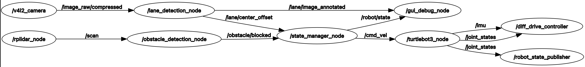
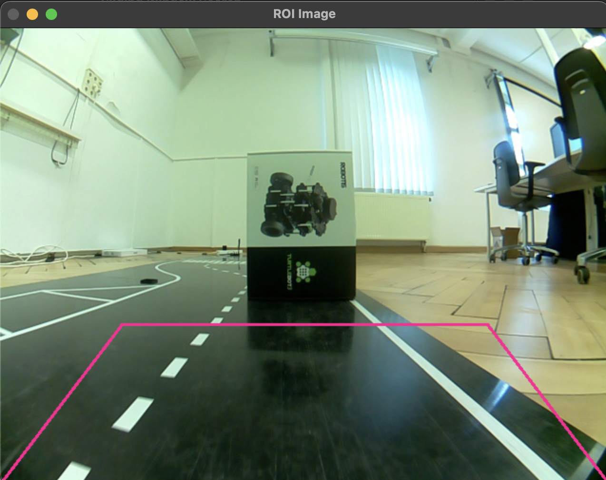

# Exposé-Vortrag: ROS 2 Projekt "waymo"

<!-- data-type="none" -->
| Parameter            | Kursinformationen                                                            |
| -------------------- | -----------------------------------------------------------------------------|
| **Veranstaltung:**   | `Robotik Projekt`                                                            |
| **Semester**         | `Sommersemester 2025`                                                        |
| **Hochschule:**      | `Technische Universität Berkakademie Freiberg`                               |
| **Inhalte:**         | `Exposé Vortrag`                                                             |
| **Link auf GitHub:** | https://github.com/Bigfire3/waymo/blob/documentation/presentation/expose.md  |
| **Autoren**          | Fabian Zänker, Lucas Adler, Simon Hörtzsch @author                           |

+ Gruppenmitglieder: Fabian Zänker, Lucas Adler, Simon Hörtzsch  
+ Studiengang: Robotik | Mathematik in Wirtschaft, Engineering und Informatik | Angewandte Informatik
+ Betreuer: Prof. Dr. Sebastian Zug, Gero Licht  
+ Datum: 23.04.2025

---

## 1. Einleitung & Motivation

Entwicklung eines ROS 2-Package, welches den Roboter auf Grundlage von bestimmten Fahrbahnszenarios steuert.

**Hauptziel**

Roboter fährt voll automatisiert auf einer vorher nicht bekannten Fahrbahn, lediglich die Fahrbahnszenarios sind durch definierte Aufgaben bekannt.

---

## 2. Projekt Organisation

## 3. Systemarchitektur & Komponenten

+ Nodes:
  
  + `gui_debug_node.py`
  + `state_manager_node.py`
  + `lane_detection_node.py`
  + `obstacle_detection_node.py`

+ Visualisierung der Node-Interaktionen (Nodes und Topics):

    

+ Wichtige externe Bibliotheken:

  + OpenCV (für Auswertung und Debugging mit Kamerabildern)
  + NumPy
  + Matplotlib

---

## 4. Kernfunktionen & Implementierungsdetails

+ **Fahrbahnerkennung:**

  + Nutzung von [Dokumentation und Guide zur Real-Time Lane Detection](https://automaticaddison.com/the-ultimate-guide-to-real-time-lane-detection-using-opencv/) von Addison Sears-Collins
  + Anpassung der Parameter und Ergänzung von Filtern für unser Szenario
  + Herausforderungen: Reflexion von indirekten Lichtquellen

+ **Hinderniserkennung:**

  + Nutzung der bereits implementierten Hinderniserkennung aus dem Wintersemester 2024/25
  + Nutzung von Topic `/obstacle/blocked`, um Info zu haben, ob Fahrbahn frei ist oder Hindernis im Weg steht

+ **State Manager:**

  + zentrale Verarbeitung der Topics, um die richtigen Fahrbefehle an den Roboter zu senden

---

## 5. Demonstration & Ergebnisse

+ 
+ 
+ !?[Demo-Video auf YouTube](https://youtu.be/TJ6XxX2W0BU)

---

## 6. Ausblick

+ bereits begonnen mit Aufgabe zur Erkennung des Ampelsignals
+ Verbesserung der Fahrbahnerkennung, um resistent gegen Reflexionen zu werden

**Vielen Dank für Ihre Aufmerksamkeit!**

**Fragen?**
