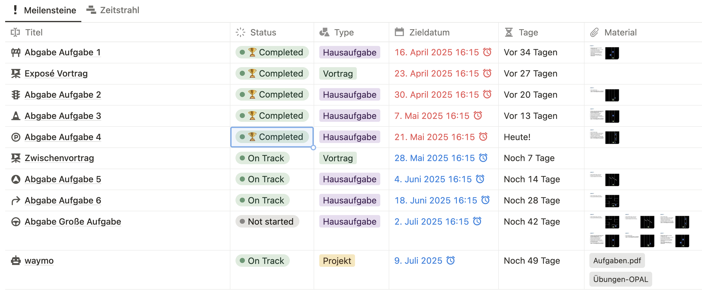
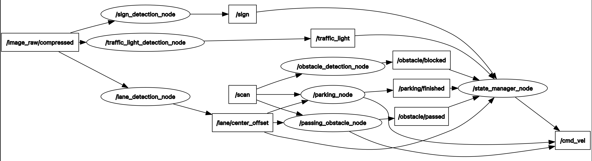
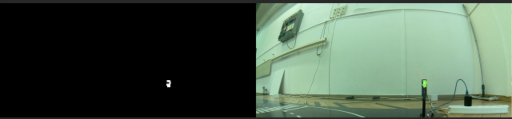
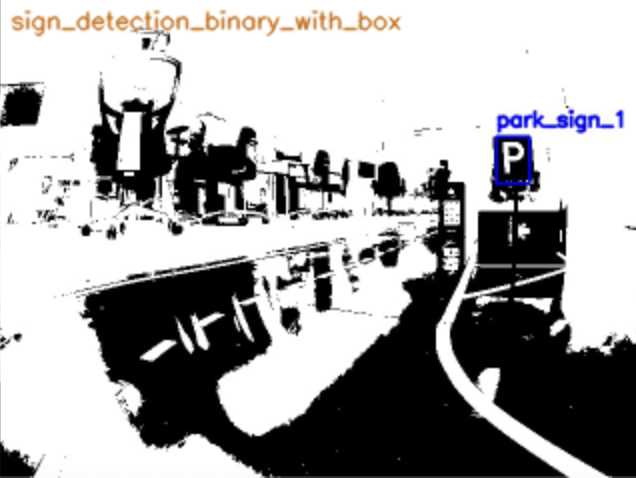
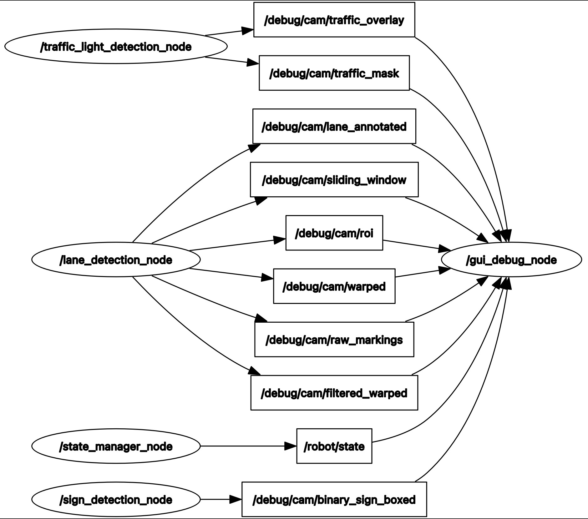
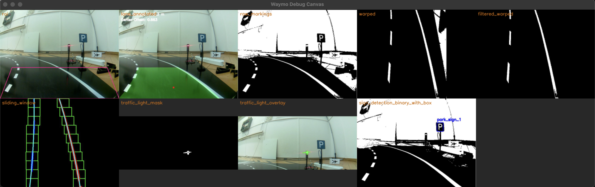

# Zwischenvortrag: ROS 2 Projekt "waymo"

<!-- data-type="none" -->
| Parameter            | Kursinformationen                                                                     |
| -------------------- | --------------------------------------------------------------------------------------|
| **Veranstaltung:**   | `Robotik Projekt`                                                                     |
| **Semester**         | `Sommersemester 2025`                                                                 |
| **Hochschule:**      | `Technische Universität Berkakademie Freiberg`                                        |
| **Inhalte:**         | `Exposé Vortrag`                                                                      |
| **Link auf GitHub:** | https://github.com/Bigfire3/waymo/blob/documentation/presentation/zwischenvortrag.md  |
| **Autoren**          | Fabian Zänker, Lucas Adler, Simon Hörtzsch @author                                    |

+ Gruppenmitglieder: Fabian Zänker, Lucas Adler, Simon Hörtzsch  
+ Studiengang: Robotik | Mathematik in Wirtschaft, Engineering und Informatik | Angewandte Informatik
+ Betreuer: Prof. Dr. Sebastian Zug, Gero Licht  
+ Datum: 28.05.2025

---

<!-- Simon -->
## 1. Projektstand

---

<!-- Fabian -->
## 2. Systemarchitektur

                         {{0-1}}
********************************************************************************

**Überlegungen:**

+ Struktur des Projektes als einzelnes Package
+ Erweiterung durch hinzufügen von Nodes mit neuem Funktionsumfang
+ Planung von Publisher und Subscriber, um gewollte Funktionalität bestmöglich umzusetzen

                         {{1-2}}
********************************************************************************

**Topics und Nodes:**

+ Visualisierung der Node-Interaktionen (Nodes und Topics):

---

<!-- Lucas -->
## 3. Kernfunktionen und Demonstration

                         {{1-2}}
********************************************************************************

**Ampelerkennung:**

  

  !?[Demo-Video](https://youtu.be/qhHBxUX1kt0)

                         {{2-3}}
********************************************************************************

**Hindernisumfahrung:**

  !?[Demo-Video Hindernisumfahrung](https://youtu.be/McEjPxxlAfo)

                         {{3-4}}
********************************************************************************

**Park-Schild-Erkennung:**

  

                         {{4-5}}
********************************************************************************

<!-- Simon -->
**Park-Manöver:**

  !?[Demo-Video Park-Manöver](https://youtu.be/R6ZFzQ-cY1E)

                         {{5-6}}
********************************************************************************

**GUI Debug Node und Keyboard Handler:**

  

  

  + Keyboard Handler: Möglichkeit zum manuellen Stoppen des Roboters
  + in separatem Terminal mit den Tasten 's' für Stop/Start und 'd' zum Togglen des Debug Canva

---

<!-- Lucas -->
## 4. Ausblick

+ Spiegelung und Reflexion auf der Fahrbahn müssen noch besser behandelt werden
+ Erweitertung um Krezungsmanöver

**Vielen Dank für Ihre Aufmerksamkeit!**

**Fragen?**
